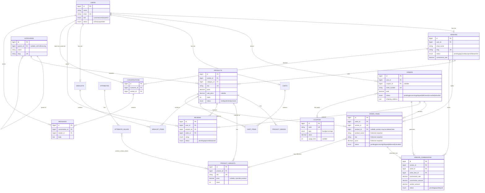

# MarketHub — Entity Relationship Diagram

GitHub renders Mermaid natively, so this diagram displays as-is on the
repo's page — no external tool needed. It covers the core commerce
schema from `database/migrations/` (Phase 1); the users/cache/jobs
tables are omitted since they're Laravel's own scaffolding, not
MarketHub's domain model.

## Notable design decisions this diagram makes visible

- **`order_items` denormalizes `product_name`, `sku`, and `price`**
  rather than only foreign-keying to `products` — section 6.3's
  business rule that historical orders must stay immutable even after
  a product is edited or deleted. `product_id` is nullable for exactly
  this reason.
- **`vendor_commissions` foreign-keys to both `order_id` and
  `order_item_id`** — one commission row per line item, not per order,
  because a single order can span multiple vendors and each vendor
  earns only on their own items.
- **`categories.parent_id` self-references `categories`** for the
  two-level category tree (top-level + subcategories) used throughout
  the storefront and admin.
- **`product_variant_values` is a pure pivot** (composite primary key,
  no own `id`) between `product_variants` and `attribute_values` — a
  variant is defined entirely by which attribute values it combines
  (e.g. Color: Navy + Size: M).
